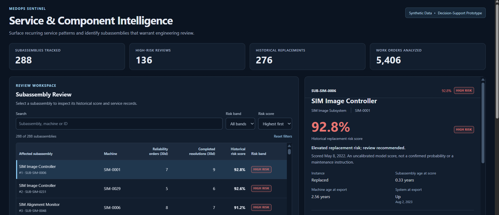
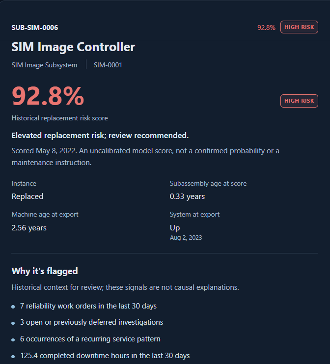
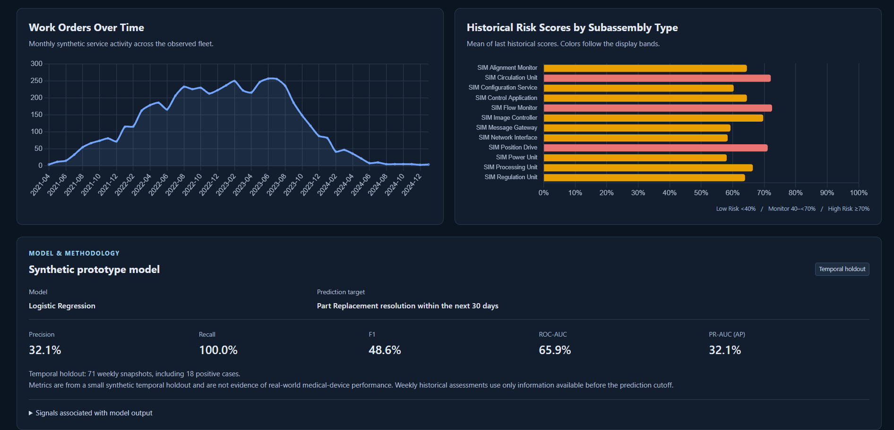
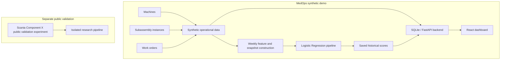

# MedOps Sentinel

**Service & Component Intelligence for Equipment Maintenance**

MedOps Sentinel is a service-intelligence prototype for exploring equipment work orders, downtime, recurring problems, and resolution history to identify subassemblies that warrant engineering review. It combines an operational dashboard with a leakage-aware machine-learning pipeline that produces historical component risk scores. **All operational records shown in the application are synthetic; this is engineering decision-support research, not clinical software.**

[Product walkthrough](#product-walkthrough) · [Methodology](#ml-problem--methodology) · [External reality check](#external-reality-check-scania-component-x) · [Run the demo](#run-the-frozen-demo)

## Why I Built This

Conversations about service-engineering workflows in the medical-device industry prompted a question: how can engineers make sense of accumulated work orders, subsystem failures, downtime, investigations, repairs, and replacements? I built MedOps to explore how those histories could support recurring-pattern review. The application was intentionally developed with synthetic operational records rather than private company or customer data.

## Product Walkthrough

1. **Dashboard / first viewport:** scan the fleet's subassembly count, historical replacements, work-order volume, and high-risk review count.
2. **Subassembly Review + detail:** search by subassembly, machine, or ID; sort historical scores; filter review bands; inspect a selected instance's dated assessment, review signals, and recent work orders.
3. **Analytics / Model & Methodology:** explore monthly work-order trends and score summaries, then inspect the model's target, reported metrics, and limitations.





### Key Features

- Fleet and service overview with searchable, sortable subassembly review.
- Low Risk / Monitor / High Risk display bands and dated historical scores.
- Readable review signals and service context; these are associations, not causal explanations.
- Recent work-order history with severity, resolution, and completed downtime.
- Work-order trends, historical score summaries, and model/methodology transparency.
- Explicit synthetic-data disclosure throughout the application.

Each displayed score is the instance's **last eligible historical assessment**, including replaced instances. The detail panel separates that assessment from the full recorded work-order history, which may include later events.

## System Architecture



Feature construction and model fitting are offline research steps. Normal application startup loads the frozen CSVs and saved scores into SQLite; it does not train a model. Scania has no connection to the dashboard's data flow.

## Data Model

**Machine → Subassembly Instance → Work Orders**

| Entity | What it represents |
| --- | --- |
| Machine | Synthetic identifier, installation date/age, and system status with an export as-of date. |
| Subassembly instance | An installed component tied to a machine, with an affected-subassembly type, product subsystem, and installation date/age. |
| Work order | Order type, problem category, severity, downtime, resolution, and creation/investigation/resolution/closure timestamps. |

The frozen demo contains **36 machines, 288 subassembly instances, and 5,406 work orders**. Weekly snapshots are derived data, separate from the three normalized operational tables. See the [complete synthetic schema](docs/synthetic_schema.md) for fields, relationships, and timestamp rules.

## ML Problem & Methodology

At weekly assessment time **T**, the target is whether the same subassembly receives a **Part Replacement** resolution during:

```text
T < resolved_on <= T + 30 days
```

Monday snapshots use information available strictly before T, require complete 30-day follow-up, and stop at replacement. Resolution time defines the outcome; work-order creation and administrative closure do not.

- Chronological train/validation/test partitions use 30-day purged intervals, giving 35 days between retained weekly dates.
- Categorical inputs use one-hot encoding; numeric inputs are standardized. Preprocessing fits training data only.
- A majority baseline, Logistic Regression, and Random Forest were compared. Model choice and binary thresholds used validation only; the temporal test remained untouched until those choices were frozen.
- Logistic Regression was selected under the prespecified validation-performance and interpretability preference. The saved pipeline is the original training-only fit.

### Leakage Prevention

Prediction-time features exclude future resolution outcomes and timestamps, final closure state, resolution descriptions, investigation findings, and unfinished downtime totals. Historical resolution counts and completed downtime enter features only when their timestamps are strictly before T.

Independent feature reconstruction, future-information mutation checks, and timestamp boundary tests were used to check cutoff behavior. These checks provide evidence about the implementation, not a mathematical guarantee of zero leakage. See the [feature availability audit](docs/feature_audit.md).

### Accepted Synthetic Results

**Selected model: Logistic Regression. Temporal holdout: 71 weekly snapshots, 18 positive cases.**

| Metric | At the validation-selected threshold of 0.49 |
| --- | ---: |
| Precision | 32.1% |
| Recall | 100.0% |
| F1 | 48.6% |
| ROC-AUC | 65.9% |
| PR-AUC / Average Precision | 32.1% |

This is a small, synthetic holdout with uncalibrated scores. The 100% recall reflects only **18 positive cases**, alongside 38 false positives; it is not evidence of real-world medical-device performance. See the [accepted synthetic report](models/schema_migration_report.md) and [machine-readable metrics](models/component_metrics.json).

### Display Bands vs. Evaluation Threshold

| Dashboard band | Displayed score |
| --- | --- |
| Low Risk | <40% |
| Monitor | 40% to <70% |
| High Risk | ≥70% |

These are review-oriented UI bands, **not** the model's binary evaluation threshold of 0.49. A percentage score is not a calibrated probability or a maintenance directive.

## External Reality Check: Scania Component X

Synthetic performance can be misleading, so I separately tested the methodology on **Scania Component X v3**, an independent, real-origin public maintenance dataset. It contains industrial vehicle data, **not medical-device data**, and is not used by the MedOps dashboard. Source lives under `ml/public_validation/`, with official vehicle-disjoint splits and a separate feature/target definition for released repair-proximity labels.

Random Forest was selected using validation only. The accepted result remains unchanged:

| Measure | Result |
| --- | ---: |
| Validation Average Precision | ≈0.074 |
| Test Average Precision | ≈0.050 |
| Test ROC-AUC | ≈0.629 |
| Test precision at frozen selected threshold | ≈4.44% |
| Test recall at frozen selected threshold | ≈1.41% |
| Test positives detected | 2 of 142 |

The experiment showed modest ranking signal but **poor calibration and poor threshold transfer**. It does not establish operational usefulness or validate MedOps for medical equipment. No post-test tuning followed the result.

External evaluation exposed a large gap between controlled synthetic experimentation and independent real-origin data. Preserving and explaining that result is part of the engineering work. Read the [accepted Scania report](models/public_validation/scania_component_x/report.md) and [experiment documentation](ml/public_validation/scania_component_x/README.md).

## Limitations

- Operational records are synthetic; lifecycle and category behavior simplify real service systems.
- The synthetic temporal holdout is small, and overlapping weekly observations are not fully independent.
- Risk scores are uncalibrated; UI bands do not prescribe maintenance or replacement.
- The external experiment transferred poorly and concerns industrial vehicles, not medical devices.
- No clinical validation, production deployment, real-time integration, or autonomous maintenance is claimed.

## Tech Stack

| Layer | Technologies |
| --- | --- |
| Frontend | React, TypeScript, Vite |
| Backend | Python, FastAPI, SQLite |
| ML / Data | pandas, scikit-learn, NumPy, joblib |
| Visualization | Chart.js through react-chartjs-2 |

## Run the Frozen Demo

No data generation, model training, or Scania download is needed. The repository includes the frozen synthetic CSVs, model, and metrics used by the demo.

**Tested environment:** Windows PowerShell, Python **3.13.2**, Node.js **24.20.0**, npm **11.19.0**. Install Python and Node/npm first; Git is needed only if cloning.

### 1. Get the project and install dependencies

Clone the repository and install dependencies in PowerShell:

```powershell
git clone https://github.com/Singh107/medops-sentinel.git
cd medops-sentinel
python -m venv .venv
.\.venv\Scripts\Activate.ps1
python -m pip install -r requirements.txt
cd frontend
npm.cmd ci
cd ..
```

### 2. Start the backend

From the project root with the virtual environment active:

```powershell
python -m uvicorn backend.main:app --reload --port 8001
```

Startup creates/seeds the local SQLite database from the frozen CSVs. Do not call `POST /api/seed` for normal startup: that research endpoint regenerates data and retrains.

### 3. Start the frontend

Open a second terminal at the project root:

```powershell
cd frontend
npm.cmd run dev
```

- Dashboard: [localhost:5173](http://localhost:5173)
- Backend: [localhost:8001](http://localhost:8001) — health check at [/health](http://localhost:8001/health)
- Interactive API docs: [localhost:8001/docs](http://localhost:8001/docs)

Vite is configured for port 5173; keep that port available. For a production frontend build, run `npm.cmd run build` from `frontend/`.

`npm.cmd` avoids PowerShell's script-execution restriction on `npm.ps1`. If virtual-environment activation is restricted, use `.\.venv\Scripts\python.exe` explicitly for the Python commands from the project root. On POSIX, activate with `source .venv/bin/activate` and use `npm`; the tested environment above is Windows.

## Optional Research / Reproduction

Research is separate from normal demo startup. The [frozen-demo and reproduction guide](docs/frozen_demo_and_reproduction.md) covers:

- Synthetic generation with `ml.generate_service_data` and training with `ml.component_model`, in a separate research copy because they overwrite artifacts.
- Snapshot tests, feature audits, and application consistency checks, including which checks write reports.
- `scripts/prepare_scania_reproduction.py`, which stages source in a new isolated workspace without downloading data or running an experiment.

Preserve the accepted artifacts and Scania freeze seal. A new reproduction produces its own outputs; it does not replace the completed experiment's evidence.

## Project Structure

```text
MedOps/
├── backend/                  # FastAPI routes, service queries, SQLite loading
├── frontend/                 # React dashboard and frontend QA script
├── ml/                       # Synthetic generation, snapshots, models, audits
│   └── public_validation/    # Isolated Scania research source and protocol
├── data/                     # Frozen synthetic CSVs and public-data manifest
├── models/                   # Frozen demo model, metrics, and research evidence
├── docs/                     # Schema, feature audit, reproduction, commit inventory
├── scripts/                  # Independent reproduction workspace preparation
├── requirements.txt          # Application and synthetic ML dependencies
├── LICENSE                   # MIT license for MedOps source code
└── README.md
```

Dependencies, runtime SQLite, Scania raw downloads/PDFs, large feature matrices, and fitted Scania pipelines are ignored. Small public-validation reports, metrics, and prediction evidence remain included.

## Privacy / Data Boundaries

The operational dashboard uses fictional records with SIM-style machine, subassembly, and work-order identifiers. No private company service records, patient records, or proprietary Salesforce exports are included. Scania material is independently public data and remains isolated from the dashboard.

## What I Learned

I learned to define the prediction timestamp before designing features: a field present in an export is not necessarily information an engineer could have known at assessment time. Separating display bands from evaluation thresholds also made the interface's claims clearer. The Scania result reinforced why reproducible experiments and honest external evaluation matter more than preserving an impressive synthetic metric. Turning a model output into engineering decision support requires showing its date, supporting service context, and limits alongside the score.

## License & Data Attribution

MedOps source code is licensed under the [MIT License](LICENSE), copyright 2026 Agam Singh. This license does **not** apply to third-party Scania data.

Scania Component X v3 retains its own dataset license and attribution terms, including [CC BY 4.0](https://creativecommons.org/licenses/by/4.0/). Credit: Tony Lindgren, Olof Steinert, Oskar Andersson Reyna, Zahra Kharazian, and Sindri Magnusson; Scania CV AB and Stockholm University; Swedish National Data Service / Researchdata.se. See the [release DOI](https://doi.org/10.5878/bnh5-ka77) and [public-validation attribution](ml/public_validation/scania_component_x/README.md#dataset-and-attribution).

Raw Scania downloads are ignored and are not redistributed through this repository. The public dataset is acknowledged as an independent research source; no ownership of it is claimed.
